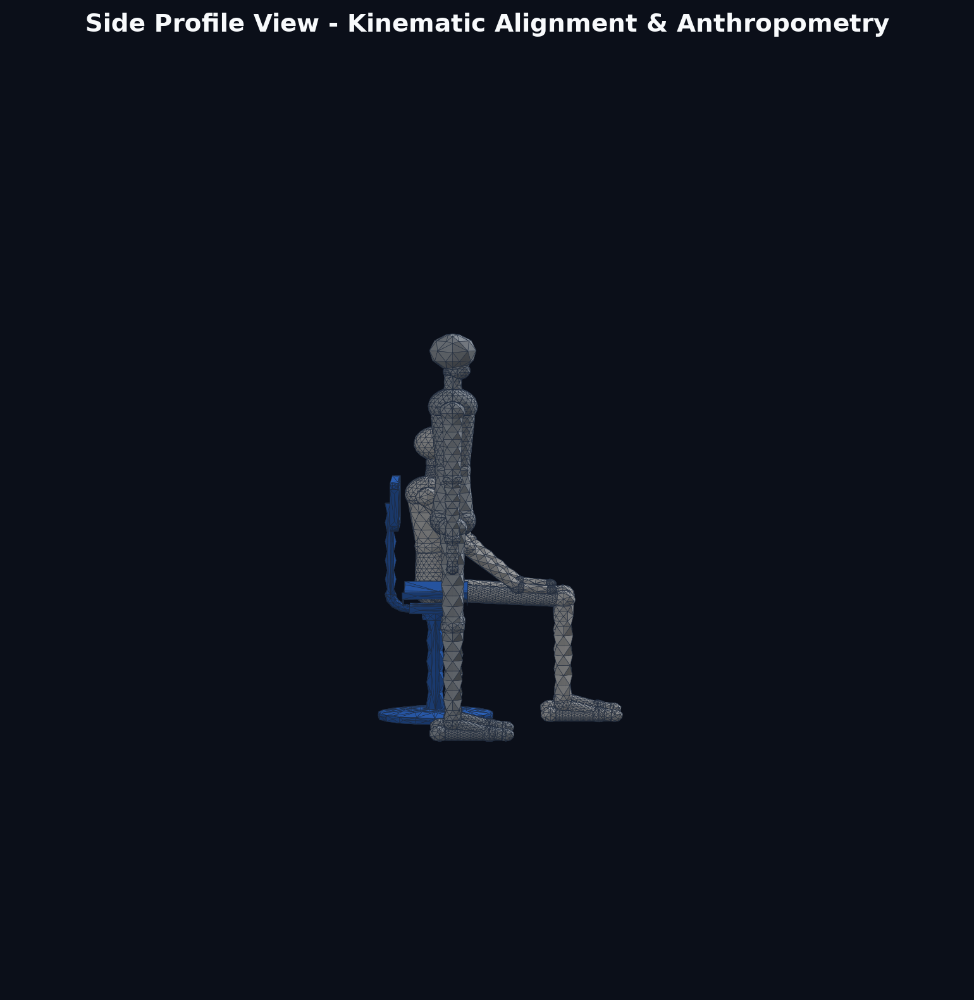

# Machine Art Lab (머신아트랩) - 3D Chair & Anthropometric Mannequin Study

스케치 및 실물 메커니즘을 기반으로 제작된 **1:10 축척 의자, 착석 인체, 직립 인체** 3D 파라메트릭 CAD 모델 및 3D 프린팅 데이터셋입니다.

---

## 📸 3D 모델 렌더링 프리뷰 (Visual Previews)

### 1. 종합 비교 뷰 (Comparative Isometric View)
> 의자, 착석 인체, 그리고 동일한 1:10 스케일의 서있는 인체가 동일 지면(Z=0)에 배치된 전체 스케일 비교 씬입니다.


---

### 2. 측면 프로파일 뷰 (Side Profile View)
> 스케치와 1:1 대응되는 측면 뷰로, 좌판 높이(50mm), 지면 착지(Z=0), 등받이 지지 파이프 곡률, 등받이 정렬을 확인할 수 있습니다.



---

### 3. 의자 + 착석 인체 어셈블리 (Chair with Seated Figure)
> 둔부가 좌판에 안착하고, 양 발이 바닥에 닿으며, 등이 등받이에 자연스럽게 닿는 인간공학적 배치입니다.


---

### 4. 의자 메커니즘 단독 뷰 (Chair Mechanism Detail)
> 스케치 치수(좌판 40×20mm, 등받이 40×20mm, 총 높이 100mm)와 실물 메커니즘(곡면 좌판, C형 파이프, 지지 칼라, 베이스)을 구현한 솔리드 모델입니다.


---

### 5. 1:10 스케일 서있는 인체 (Standing Mannequin)
> 성인 신장 약 168cm를 1:10 축척(163.4mm)으로 정확하게 환산한 관절형 마네킹 모델입니다.


---

## 📐 설계 사양 및 치수 (Specifications)

| 구성 요소 | 실물 환산 기준 (1:1) | 3D 모델 치수 (1:10 축척) | 상세 형상 특징 |
| :--- | :--- | :--- | :--- |
| **의자 좌판 (Seat)** | 400 × 200 mm | **40.0 × 20.0 × 2.5 mm** | 안장형 오목 곡면(곡률 반경 45mm), 사방 모서리 라운딩 가공 |
| **의자 등받이 (Backrest)** | 400 × 200 mm | **40.0 × 20.0 × 2.5 mm** | 라운딩 사각 플레이트, 중앙 Z=90mm 배치 |
| **의자 총 높이 (Height)** | 약 1,000 mm (1m) | **100.0 mm (10cm)** | 지면(Z=0)부터 등받이 최상단(Z=100mm)까지 |
| **좌판 높이 (Seat Height)** | 약 500 mm | **50.0 mm (5cm)** | 지면에서 좌판 상단 표면까지 |
| **등받이 지지관 (Tube)** | $\varnothing 36\text{ mm}$ 파이프 | **$\varnothing 3.6\text{ mm}$ 솔리드 튜브** | 좌판 하부에서 후방으로 C자형 토러스 벤딩 후 수직 상승 |
| **메인 지지대 (Pillar)** | $\varnothing 56\text{ mm}$ 파이프 | **$\varnothing 5.6\text{ mm}$ 기둥 + $\varnothing 8.4\text{ mm}$ 칼라** | 키네틱 링크 및 메커니즘용 칼라 피팅 포함 |
| **베이스 받침 (Base Pedestal)**| $\varnothing 360\text{ mm}$ 플랜지 | **$\varnothing 36.0\text{ mm}$ 원형 베이스** | 단독 기립 및 3D 프린팅 베드 접착을 위한 안정형 원반 |
| **서있는 인체 (Standing Figure)**| 약 168 cm (성인 기준) | **163.4 mm (전신 높이)** | 발바닥 Z=0 접지, 1:10 인체 비례 구형 볼 조인트 마네킹 |
| **앉아있는 인체 (Seated Figure)**| 착석 높이 약 122 cm | **122.4 mm (두부 최상단)** | 대퇴부 수평 거치, 무릎 90° 굴곡, 발바닥 Z=0 접지, 손 허벅지 거치 |

---

## 📁 3D 모델 파일 목록 (File Catalog)

모든 3D 파일은 표준 파라메트릭 CAD 포맷인 **STEP (.step)** 및 3D 프린팅 전용 고해상도 **STL (.stl)** 포맷으로 제공됩니다.

### 1. `models/` 디렉터리
- [`chair.step`](models/chair.step) / [`chair.stl`](models/chair.stl) : 의자 단독 모델
- [`person_seated.step`](models/person_seated.step) / [`person_seated.stl`](models/person_seated.stl) : 의자에 착석한 인체 마네킹
- [`person_standing.step`](models/person_standing.step) / [`person_standing.stl`](models/person_standing.stl) : 동일 스케일 서있는 인체 마네킹
- [`chair_with_seated_person.step`](models/chair_with_seated_person.step) / [`chair_with_seated_person.stl`](models/chair_with_seated_person.stl) : 의자 + 착석 인체 결합 어셈블리
- [`comparison_scene.step`](models/comparison_scene.step) / [`comparison_scene.stl`](models/comparison_scene.stl) : 의자 + 착석 인체 + 직립 인체 종합 비교 씬

### 2. 소스 코드
- [`generate_chair_and_figures.py`](generate_chair_and_figures.py) : FreeCAD OpenCASCADE 기반 3D 파라메트릭 지오메트리 빌드, STEP/STL 내보내기 및 렌더링 자동화 스크립트

---

## 🖨️ 3D 프린팅 권장 설정 (3D Printing Recommendations)

1. **SLA / DLP 레진 프린터 (강력 권장)**:
   - 1:10 스케일의 세밀한 관절 볼 조인트와 얇은 등받이 파이프($\varnothing 3.6\text{mm}$)를 고품질로 출력하기에 가장 적합합니다.
   - 레이어 두께: `0.05 mm`
   - 빌드 플레이트에서 약 `30° ~ 45°` 기울여 오토 서포트 생성 권장.

2. **FDM 프린터**:
   - 노즐: `0.4 mm` 이하 (가능하다면 `0.2 mm` 노즐 권장)
   - 레이어 높이: `0.12 mm ~ 0.16 mm`
   - 인필(Infill): `20% ~ 30%` (Gyroid 권장)
   - 서포트: 트리 서포트(Tree Support) 권장 (오버행 45° 이상)

---

## 🚀 파이썬 스크립트 실행 방법

로컬에서 FreeCAD 환경을 통해 지오메트리 및 이미지를 재생성하려면 아래 명령어를 실행합니다:

```bash
python generate_chair_and_figures.py
```
