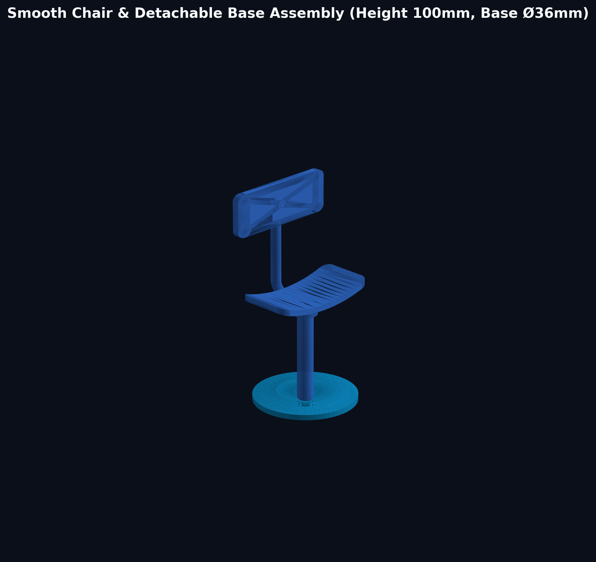
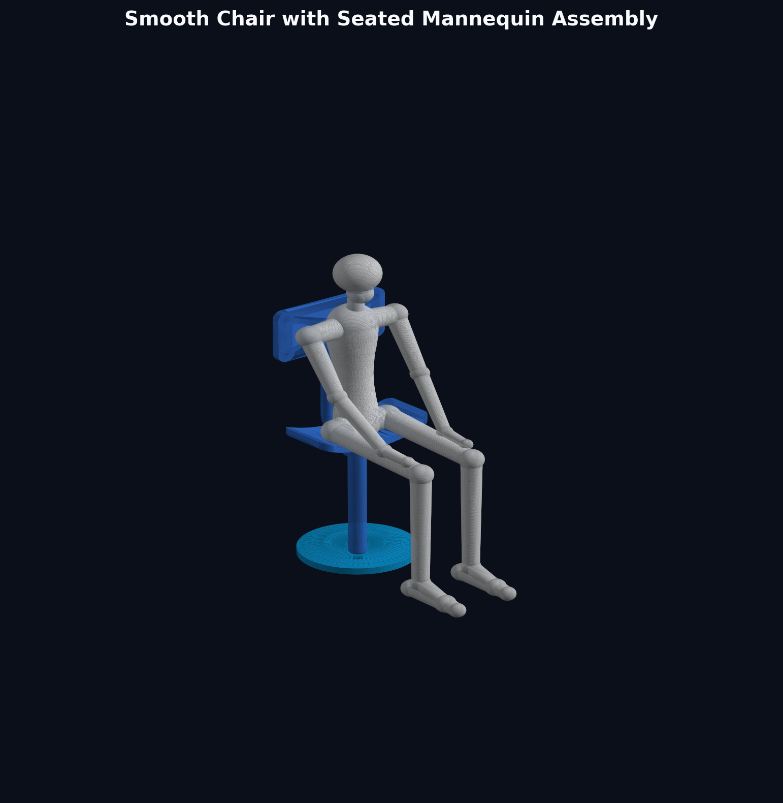
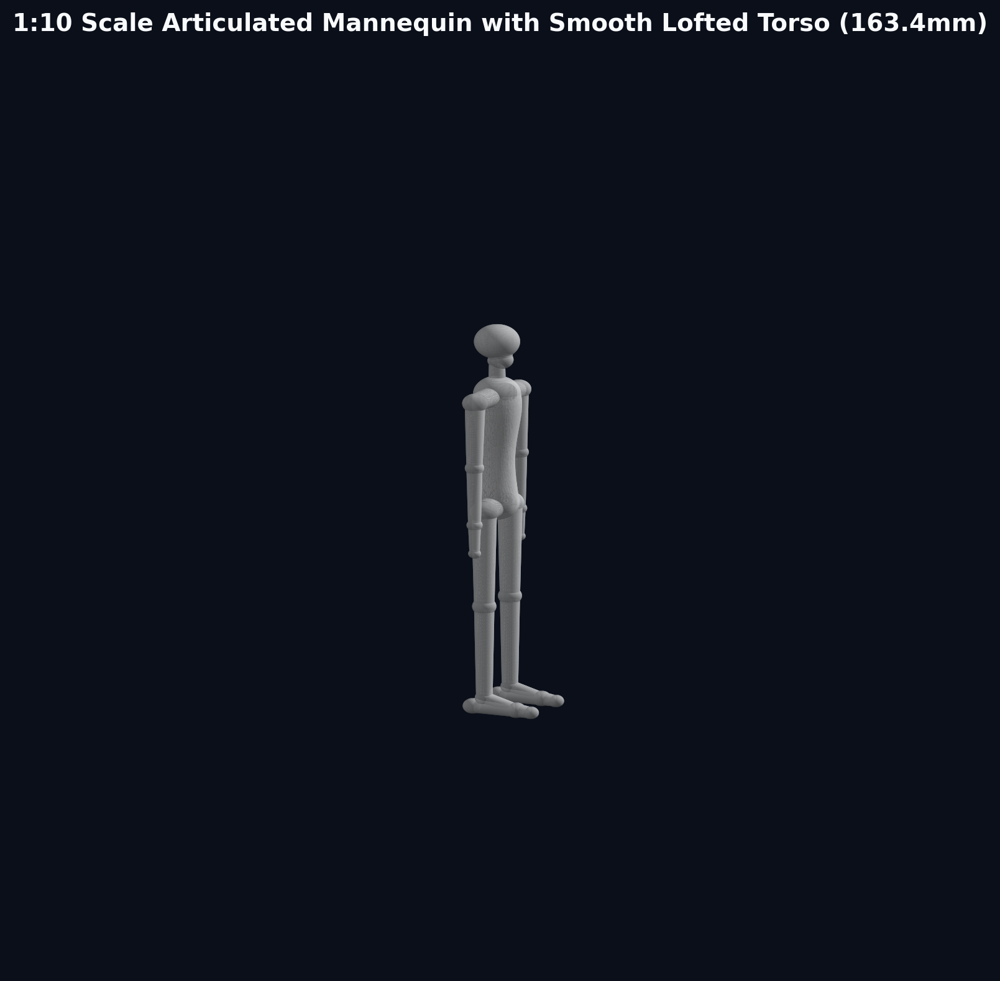
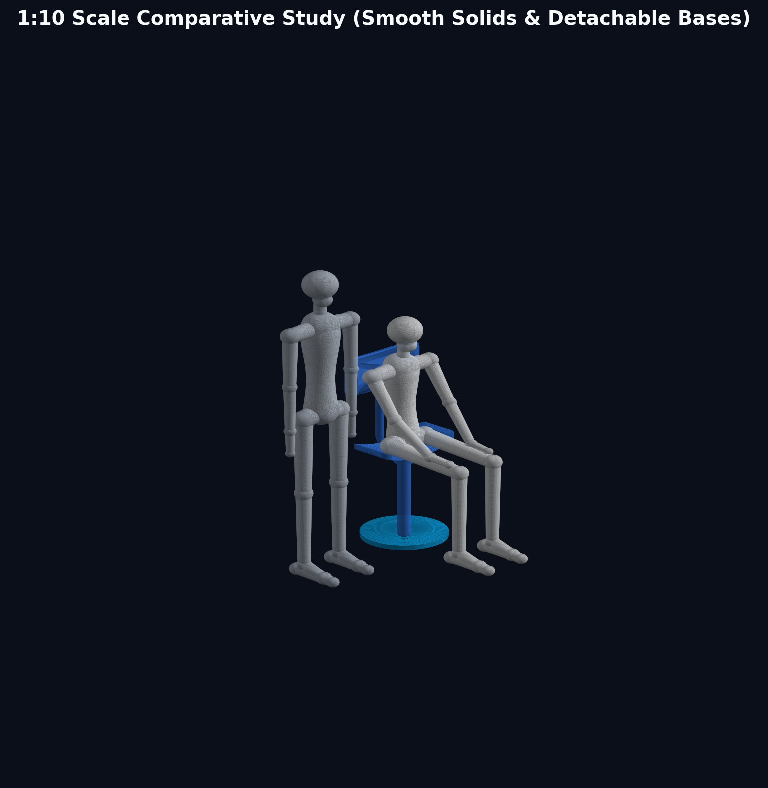
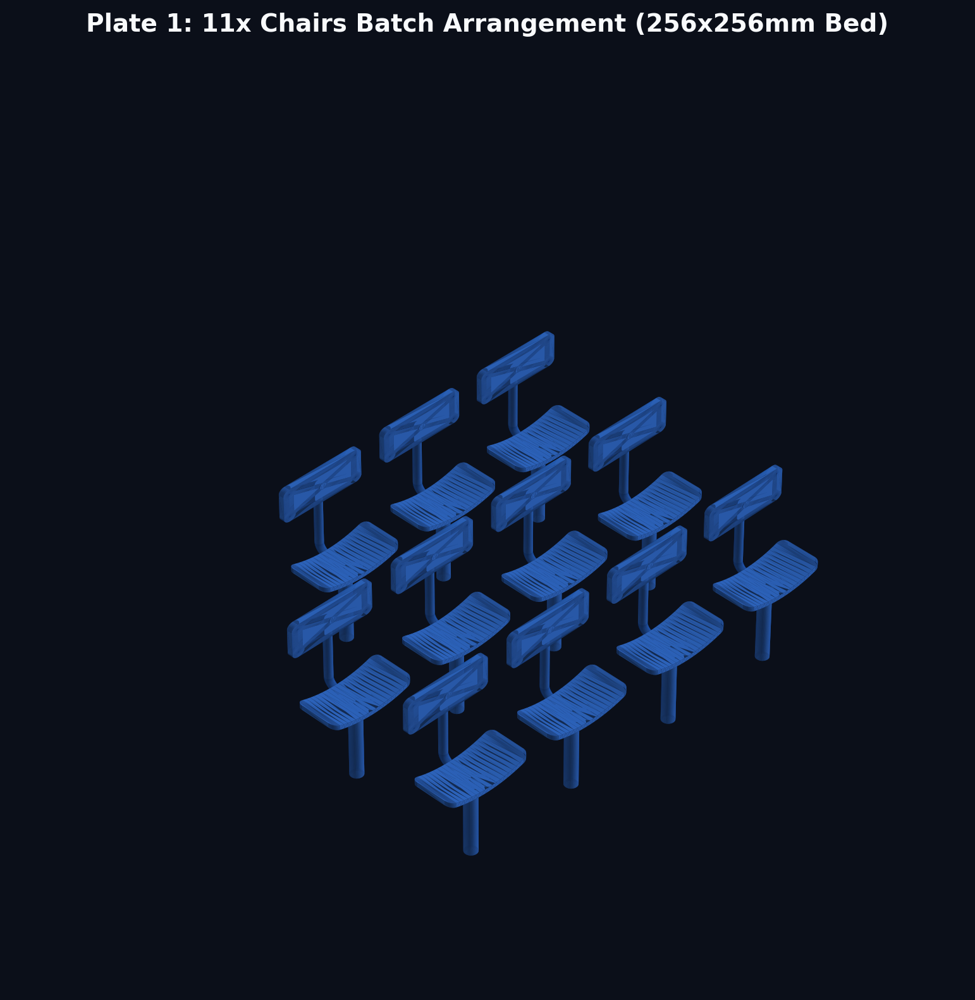
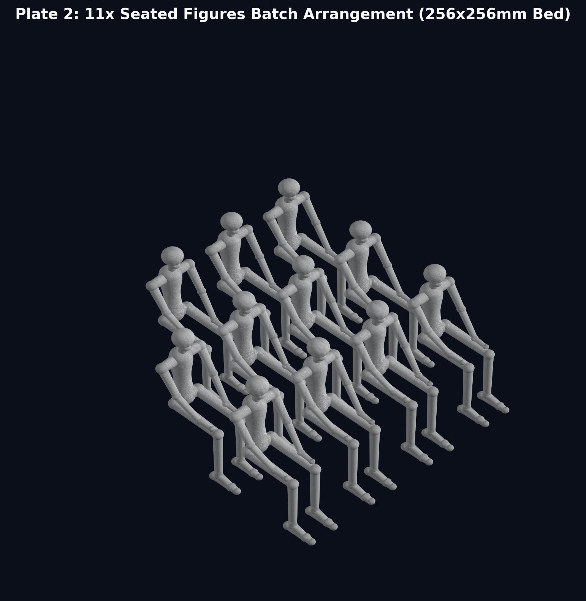
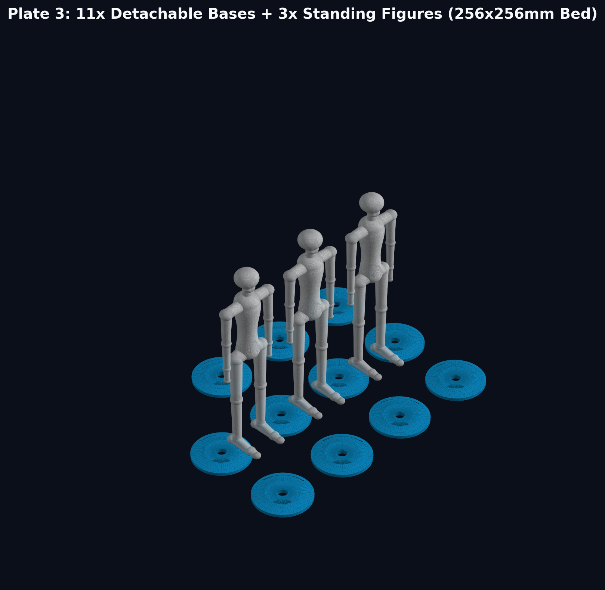

# Machine Art Lab (머신아트랩) - 3D Chair & Anthropometric Mannequin Study

스케치 및 실물 메커니즘을 기반으로 제작된 **1:10 축척 의자, 분리형 원판 베이스, 착석 인체, 직립 인체** 3D 파라메트릭 CAD 모델 및 **Bambu Lab 256×256mm 슬라이서 전용 멀티 플레이트 배치 데이터셋**입니다.

---

## 📸 3D 모델 렌더링 프리뷰 (Visual Previews)

### 1. 매끄러운 의자 & 분리형 원판 베이스 어셈블리 (Smooth Chair & Detachable Base)
> 기존의 각진 다각형 기둥과 각진 사각 브라켓을 완전한 원기둥 및 유선형 원뿔 보스로 개선하고, 하부 원판 베이스를 $\varnothing 5.8\text{mm}$ 결합 홀을 갖춘 탈착식 부품으로 분리하였습니다.

---

### 2. 의자 + 착석 인체 어셈블리 (Chair with Seated Figure)
> 척추의 자연스러운 S자 곡률을 따르는 매끄러운 로프트 몸통, 둥근 어깨/골반 라인을 갖춘 유선형 마네킹이 의자에 자연스럽게 착석한 결합 어셈블리입니다.

---

### 3. 직립 인체 단독 뷰 (Standing Mannequin)
> 성인 신장 168cm 기준 1:10 스케일(163.4mm)로 제작된 유선형 관절 마네킹입니다.

---

### 4. 종합 스케일 비교 씬 (Comparative Study)
> 의자, 착석 인체, 직립 인체가 동일 지면(Z=0)에 정렬된 1:10 축척 비교 씬입니다.

---

## 🖨️ 3D 프린팅 플레이트 배치 뷰 (Batch Print Plates)

Bambu Studio / OrcaSlicer (256×256mm 빌드 플레이트)에 바로 올려 출력할 수 있도록 부품별 간격과 서포트가 최적화 배치된 전용 플레이트입니다.

### [Plate 1] 의자 본체 11개 배치 (11x Chairs)
> 3행 × 4열 그리드 배치 (부품 간격 14~25mm 확보). 기둥 하단이 베드에 밀착되며 슬라이서 브림 권장.

---

### [Plate 2] 앉아있는 사람 11개 배치 (11x Seated Figures)
> 3행 × 4열 그리드 배치. 트리 서포트(Tree Support) 생성 및 냉각을 위한 최적 간격 확보.

---

### [Plate 3] 분리형 원판 11개 + 서있는 사람 3개 복합 배치 (11x Bases + 3x Standing Figures)
> 후열에 서있는 사람 3개, 전열에 납작한 원판 베이스 11개 일괄 배치.

---

## 📐 설계 사양 및 치수 (Specifications)

| 구성 요소 | 실물 환산 기준 (1:1) | 3D 모델 치수 (1:10 축척) | 상세 형상 특징 |
| :--- | :--- | :--- | :--- |
| **의자 좌판 (Seat)** | 400 × 200 mm | **40.0 × 20.0 × 2.5 mm** | 안장형 오목 곡면(곡률 반경 45mm), 사방 모서리 R=3.0mm 풀 라운딩 가공 |
| **의자 등받이 (Backrest)** | 400 × 200 mm | **40.0 × 20.0 × 2.5 mm** | 등을 감싸는 곡면 플레이트, 모서리 R=3.0mm 풀 라운딩, 중앙 Z=90mm 배치 |
| **의자 총 높이 (Height)** | 약 1,000 mm (1m) | **100.0 mm (10cm)** | 지면(Z=0)부터 등받이 최상단(Z=100mm)까지 |
| **좌판 높이 (Seat Height)** | 약 500 mm | **50.0 mm (5cm)** | 지면에서 좌판 상단 표면까지 |
| **등받이 지지관 (Tube)** | $\varnothing 36\text{ mm}$ 파이프 | **$\varnothing 3.6\text{ mm}$ 솔리드 튜브** | 3차원 스윕 파이프로 좌판 하부에서 C자형 토러스 벤딩 후 수직 상승 |
| **메인 지지 기둥 (Pillar)** | $\varnothing 56\text{ mm}$ 파이프 | **$\varnothing 5.6\text{ mm}$ 매끈한 원기둥** | 하단 Z=0 인입 챔퍼 가공, $\varnothing 8.4\text{ mm}$ 메커니즘 칼라 및 원뿔형 브라켓 포함 |
| **분리형 원판 베이스 (Base)** | $\varnothing 360\text{ mm}$ 플랜지 | **$\varnothing 36.0\text{ mm} \times 4.0\text{ mm}$ 원형 판** | **기둥과 분리형 제작**. 중앙에 $\varnothing 5.8\text{ mm}$ 관통 결합 홀 및 가이드 챔퍼 적용 |
| **서있는 인체 (Standing Figure)**| 약 168 cm (성인 기준) | **163.4 mm (전신 높이)** | 발바닥 Z=0 접지, S자 척추 로프트 몸통, 둥근 승모근/골반 요람 적용 |
| **앉아있는 인체 (Seated Figure)**| 착석 높이 약 122 cm | **122.4 mm (두부 최상단)** | 대퇴부 수평 안착, 무릎 90° 굴곡, 발바닥 Z=0 접지, 손 허벅지 거치 |

---

## 📁 3D 모델 및 플레이트 파일 목록 (File Catalog)

모든 3D 파일은 표준 CAD 포맷인 **STEP (.step)**, 슬라이서 최적화 포맷인 **3MF (.3mf)** 및 **STL (.stl)** 포맷으로 제공됩니다.

### 1. `models/plates/` 디렉터리 (플레이트별 일괄 출력용)
- **Plate 1 (의자 본체 11개)**: [`Plate1_Chairs_x11.3mf`](models/plates/Plate1_Chairs_x11.3mf), [`Plate1_Chairs_x11.stl`](models/plates/Plate1_Chairs_x11.stl), [`Plate1_Chairs_x11.step`](models/plates/Plate1_Chairs_x11.step)
- **Plate 2 (앉아있는 사람 11개)**: [`Plate2_Seated_Persons_x11.3mf`](models/plates/Plate2_Seated_Persons_x11.3mf), [`Plate2_Seated_Persons_x11.stl`](models/plates/Plate2_Seated_Persons_x11.stl), [`Plate2_Seated_Persons_x11.step`](models/plates/Plate2_Seated_Persons_x11.step)
- **Plate 3 (분리형 원판 11개 + 서있는 사람 3개)**: [`Plate3_Bases_x11_and_Standing_Persons_x3.3mf`](models/plates/Plate3_Bases_x11_and_Standing_Persons_x3.3mf), [`Plate3_Bases_x11_and_Standing_Persons_x3.stl`](models/plates/Plate3_Bases_x11_and_Standing_Persons_x3.stl), [`Plate3_Bases_x11_and_Standing_Persons_x3.step`](models/plates/Plate3_Bases_x11_and_Standing_Persons_x3.step)
- **Plate 3A (분리형 원판 11개 단독 초고속용)**: [`Plate3_Bases_x11.3mf`](models/plates/Plate3_Bases_x11.3mf), [`Plate3_Bases_x11.stl`](models/plates/Plate3_Bases_x11.stl), [`Plate3_Bases_x11.step`](models/plates/Plate3_Bases_x11.step)
- **Plate 4 (서있는 사람 3개 단독용)**: [`Plate4_Standing_Persons_x3.3mf`](models/plates/Plate4_Standing_Persons_x3.3mf), [`Plate4_Standing_Persons_x3.stl`](models/plates/Plate4_Standing_Persons_x3.stl), [`Plate4_Standing_Persons_x3.step`](models/plates/Plate4_Standing_Persons_x3.step)
- **Plate 일체형 (의자+착석 결합 11개 세트)**: [`Plate_Chair_with_Seated_Person_x11.3mf`](models/plates/Plate_Chair_with_Seated_Person_x11.3mf), [`Plate_Chair_with_Seated_Person_x11.stl`](models/plates/Plate_Chair_with_Seated_Person_x11.stl), [`Plate_Chair_with_Seated_Person_x11.step`](models/plates/Plate_Chair_with_Seated_Person_x11.step)

### 2. `models/` 디렉터리 (단품 및 어셈블리 모델)
- [`chair.step`](models/chair.step) / [`chair.stl`](models/chair.stl) / [`chair.3mf`](models/chair.3mf) : 의자 단품 (기둥 분리형)
- [`chair_base.step`](models/chair_base.step) / [`chair_base.stl`](models/chair_base.stl) / [`chair_base.3mf`](models/chair_base.3mf) : 분리형 원판 베이스 (중앙 홀 포함)
- [`person_seated.step`](models/person_seated.step) / [`person_seated.stl`](models/person_seated.stl) / [`person_seated.3mf`](models/person_seated.3mf) : 착석 인체 단품
- [`person_standing.step`](models/person_standing.step) / [`person_standing.stl`](models/person_standing.stl) / [`person_standing.3mf`](models/person_standing.3mf) : 직립 인체 단품
- [`chair_with_seated_person.step`](models/chair_with_seated_person.step) / [`chair_with_seated_person.stl`](models/chair_with_seated_person.stl) / [`chair_with_seated_person.3mf`](models/chair_with_seated_person.3mf) : 의자 + 베이스 + 착석 인체 결합 어셈블리
- [`comparison_scene.step`](models/comparison_scene.step) / [`comparison_scene.stl`](models/comparison_scene.stl) / [`comparison_scene.3mf`](models/comparison_scene.3mf) : 전체 스케일 비교 씬

---

## 🖨️ 3D 프린팅 권장 슬라이서 설정 (Bambu Studio / OrcaSlicer)

1. **레이어 높이**: `0.16 mm ~ 0.20 mm` Standard
2. **서포트 설정**:
   - **의자**: 기둥 하단 베드 접착력 유지를 위해 **브림(Brim) 5mm** 설정 권장, 좌판 하부 트리 서포트(Tree Support) 적용
   - **착석/직립 인체**: **트리 서포트(Tree Slim / Tree Auto)** 활성화, 오버행 임계각 45°
   - **원판 베이스**: **서포트 불필요** (바닥면 완전 평면, 상단 45° 챔퍼로 무서포트 출력)
3. **인필**: `15% ~ 20%` (Gyroid 또는 Grid)
4. **결합 공차**: 원판 홀은 $\varnothing 5.8\text{mm}$로 기둥($\varnothing 5.6\text{mm}$) 대비 +0.2mm 슬립핏 여유가 주어져 있으므로, 별도의 슬라이서 수축 보정 없이 바로 원터치 조립이 가능합니다.
