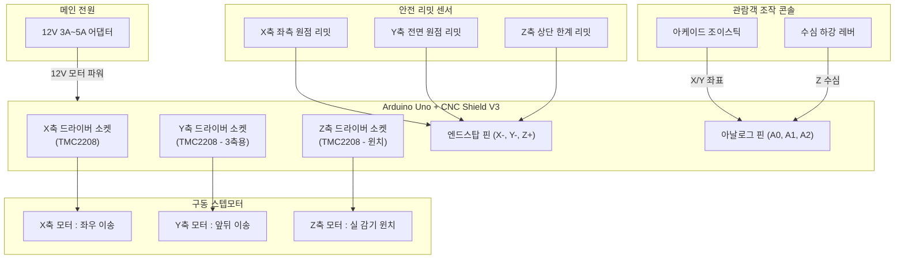

# [머신아트랩 - 변카카 작가님] 인터랙티브 인형뽑기(크레인) 수조 키네틱 설치물 종합 가이드

본 문서는 **"수조 속 실에 매달린 물체를 오락실 인형뽑기(크레인 갠트리)처럼 조이스틱과 레버로 2차원/3차원 공간에서 이동시키고 수심 깊이 잠기게 하는 인터랙티브 키네틱 아트"**의 완벽한 기획 가이드입니다.

제작 난이도와 수조 형태에 따라 선택하실 수 있도록 **[옵션 1. 전면 2축(X-Z) 방식]**과 **[옵션 2. 완전한 3축(X-Y-Z) 리얼 인형뽑기 방식]**의 하드웨어 기구 설계, 추천 부품 목록(BOM), 회로 배선도, 제어 코드를 모두 정리했습니다.

---

## 1. 두 가지 방식(2축 vs 3축) 핵심 비교

| 비교 항목 | **옵션 1. 전면 2축 (X-Z) 인형뽑기** | **옵션 2. 리얼 3축 (X-Y-Z) 인형뽑기** |
| :--- | :--- | :--- |
| **움직임 공간** | **평면 2차원 (좌우 X + 수심 상하 Z)** | **입체 3차원 (좌우 X + 앞뒤 Y + 수심 상하 Z)** |
| **추천 수조 형태** | **전면이 넓고 앞뒤 폭이 좁은 직사각형 수조** | **정사각형 큐브형 수조 또는 대형 와이드 수조** |
| **상부 기구 구조** | 수조 상단에 **단일 알루미늄 레일 1줄** 배치 | 수조 상단 전체를 덮는 **사각 프레임 갠트리** (3D 프린터 구조) |
| **모터 소요량** | **스텝모터 2개** (X축 1개, Z축 윈치 1개) | **스텝모터 3~4개** (X축 1개, Y축 1~2개, Z축 윈치 1개) |
| **관람객 조작계** | 1축 조이스틱(좌우) + 수심 레버(상하) | 2축 아케이드 조이스틱(상하좌우) + 수심 레버(또는 하강 버튼) |
| **제작 난이도** | **보통 (★☆☆☆☆ ~ ★★☆☆☆)** | **상급 (★★★☆☆ ~ ★★★★☆)** |
| **예상 기구 예산** | 약 70,000 ~ 110,000원 | 약 120,000 ~ 180,000원 |
| **전시 효과** | 깔끔하고 미니멀함, 수조 전면 감상에 최적화 | 실제 오락실 인형뽑기와 100% 동일한 몰입감과 재미 |

---

## 2. 하드웨어 기구 메커니즘 도면

### [옵션 1] 전면 2축 (X-Z) 기구 구조
수조 상단에 2020 알루미늄 프로파일 1개만 가로질러 설치되는 가장 미니멀하고 안정적인 구조입니다.
```
         [NEMA17 모터] ═══════ (GT2 타이밍 벨트) ═══════▶
         ┌──────────────────────────────────────────────┐
         │ 2020 V-슬롯 알루미늄 레일 (X축 가로대)         │
         └─────────────┬────────────────────────────────┘
                       │ [이동 캐리지 휠]
                       │  ├─ [Z축 NEMA17 모터 + 윈치 릴]
                       │  └─ (투명 낚싯줄)
 ┌─────────────────────┼──────────────────────────────┐
 │                     ▼                              │
 │                 [오 브 제]                         │ ◀ 좌/우 이동 & 상/하 승강
 │                  (수 조)                           │
 └────────────────────────────────────────────────────┘
```

---

### [옵션 2] 리얼 3축 (X-Y-Z) 기구 구조 (갠트리 크레인)
수조 상단 전체를 2020 알루미늄 사각 틀로 짜고, 3D 프린터(CoreXY 또는 직교 갠트리)처럼 카트가 2차원 평면 전체를 가로지릅니다.
```
  ┌──[Y축 레일 1]──────────────────────[Y축 레일 2]──┐
  │         │                              │         │ ◀ 앞/뒤 (Y축)
  │         ▼                              ▼         │
  │     ════╪═════════[X-Z 이동 캐리지]════╪════      │ ◀ 좌/우 (X축)
  │         │                 │            │         │
  └─────────┼─────────────────┼────────────┼─────────┘
            │                 ▼ (투명 낚싯줄)│
  ┌─────────┴─────────────────┼────────────┴─────────┐
  │                           ▼                      │
  │                       [오 브 제]                 │ ◀ 수조 속 3D 입체 유영
  │                        (수 조)                   │
  └──────────────────────────────────────────────────┘
```

---

## 3. 부품 목록 (BOM - 2축 & 3축 비교)

| 구분 | 부품명 및 세부 사양 | 옵션1 (2축) 수량 | 옵션2 (3축) 수량 | 예상 가격 | 주요 역할 및 특징 |
| :--- | :--- | :---: | :---: | :---: | :--- |
| **MCU** | **아두이노 우노 R3** | 1개 | 1개 | 10,000원 | 전체 시스템 제어 두뇌 |
| **확장 쉴드** | **Arduino CNC Shield V3** | 1개 | 1개 | 3,500원 | 3축 모터 드라이버 및 리밋 스위치 직결 쉴드 |
| **모터 드라이버** | **TMC2208 저소음 스텝 드라이버** | **2개** | **3개** | 개당 4,000원 | **전시장 필수 부품!** 모터 고주파 삐익 소음을 100% 제거 |
| **구동 모터** | **NEMA 17 스텝모터 (42각, 40mm)** | **2개** | **3개** | 개당 8,500원 | 정밀 위치 제어 및 실 감기 구동 |
| **프레임** | **2020 V-슬롯 알루미늄 프로파일** | 1~2개 | 4~5개 | 미터당 4,000원 | 가볍고 튼튼한 레일 뼈대 |
| **구동 벨트** | **GT2 타이밍 벨트(6mm) + 20T 풀리** | 1세트 | 2세트 | 세트당 5,000원 | 백래시 없는 부드러운 직교 이송 |
| **캐리지** | **V-슬롯 휠 갠트리 플레이트 세트** | 1개 | 3개 | 개당 6,000원 | 베어링 휠로 레일 위를 미끄러지듯 달리는 판 |
| **윈치 릴** | **낚싯줄 윈치 드럼 (또는 3D 프린팅 스풀)**| 1개 | 1개 | 3,000원 | 모터 축에 직결되어 실을 감고 푸는 릴 |
| **서스펜션** | **투명 카본 낚싯줄 (3호~5호)** | 1롤 | 1롤 | 3,000원 | 물에 닿아도 투명하고 튼튼한 줄 |
| **리밋 스위치** | **기계식 엔드스탑 리밋 스위치** | **2개** | **3개** | 개당 1,000원 | 부팅 시 자동 원점(Homing) 보정 및 탈선 방지 |
| **조작기 (입력)** | **아케이드 조이스틱 (또는 아날로그 조이스틱)** | 1개 | 1개 | 7,000~15,000원 | 관람객이 손으로 쥐고 조작하는 손맛 제공 |
| **수심 조작** | **슬라이드 페이더 레버 (또는 드롭 버튼)** | 1개 | 1개 | 3,000~8,000원 | 물속으로 물체를 내리는 조작 레버 |
| **전원** | **12V 3A~5A DC 전원 어댑터** | 1개 | 1개 | 10,000원 | CNC 쉴드 및 스텝모터 메인 구동 전원 |

---

## 4. 시스템 회로 배선도 (Arduino Uno + CNC Shield V3 기준)

아두이노 우노 위에 **CNC Shield V3**를 모자처럼 꽂기만 하면 납땜 없이 점퍼선만으로 모든 배선이 완성됩니다:



---

## 5. 소스 코드 파일 안내 (`src/` 폴더)

두 가지 옵션에 맞춰 최적화된 C++ 아두이노 소스코드가 모두 준비되어 있습니다:

1. **[Claw_WaterTank_2Axis.ino](file:///C:/Users/passp/Desktop/univercity/4-2/%EB%A8%B8%EC%8B%A0%EC%95%84%ED%8A%B8%EB%9E%A9/%EB%B3%80%EC%B9%B4%EC%B9%B4%EC%9E%91%EA%B0%80%EB%8B%98/src/Claw_WaterTank_2Axis/Claw_WaterTank_2Axis.ino)**
   - **옵션 1 (X-Z 2축 전면 크레인 전용)**
   - 부팅 시 Z축(상단) ➔ X축(좌측) 순차 자동 원점 복귀(Homing)
   - 조이스틱 미는 힘에 비례한 X축 속도 제어 + 레버에 비례한 Z축 수심 절대 추종
   - 탈선 방지 소프트웨어 소프트 리밋 내장

2. **[Claw_WaterTank_3Axis.ino](file:///C:/Users/passp/Desktop/univercity/4-2/%EB%A8%B8%EC%8B%A0%EC%95%84%ED%8A%B8%EB%9E%A9/%EB%B3%80%EC%B9%B4%EC%B9%B4%EC%9E%91%EA%B0%80%EB%8B%98/src/Claw_WaterTank_3Axis/Claw_WaterTank_3Axis.ino)**
   - **옵션 2 (X-Y-Z 3축 완전 갠트리 전용)**
   - 부팅 시 Z ➔ X ➔ Y 3축 완전 자동 원점 보정
   - 2축 조이스틱으로 대각선 포함 자유로운 2차원 평면 이송 + Z축 실시간 수심 연동
   - `AccelStepper` 가감속 엔진을 통한 부드러운 물 속 유영 모션 구현

---

## 6. 작가님과의 최종 선택 팁

* **수조의 가로세로 비율을 먼저 확인하세요:**
  * 만약 수조가 **전면이 넓고 앞뒤 폭이 얕은 직사각형 수조(예: 가로 60cm, 폭 15cm, 높이 30cm)**라면 ➔ **옵션 1(2축 X-Z)**이 시각적으로 훨씬 미니멀하고 기구 프레임도 전면을 가리지 않아 완벽합니다.
  * 만약 수조가 **정사각형 큐브 형태(예: 45x45x45cm)**라면 ➔ **옵션 2(3축 X-Y-Z)**로 진짜 인형뽑기 갠트리를 올려 공간 전체를 유영하게 만드는 것이 훨씬 드라마틱합니다!
